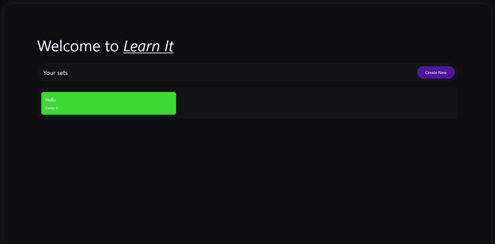
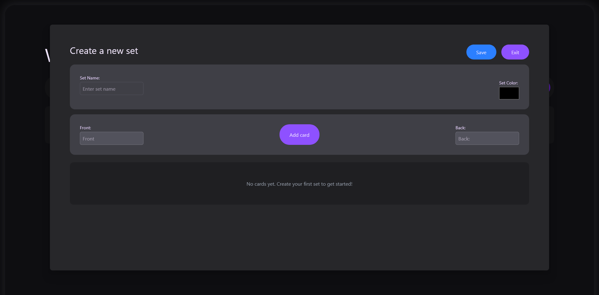
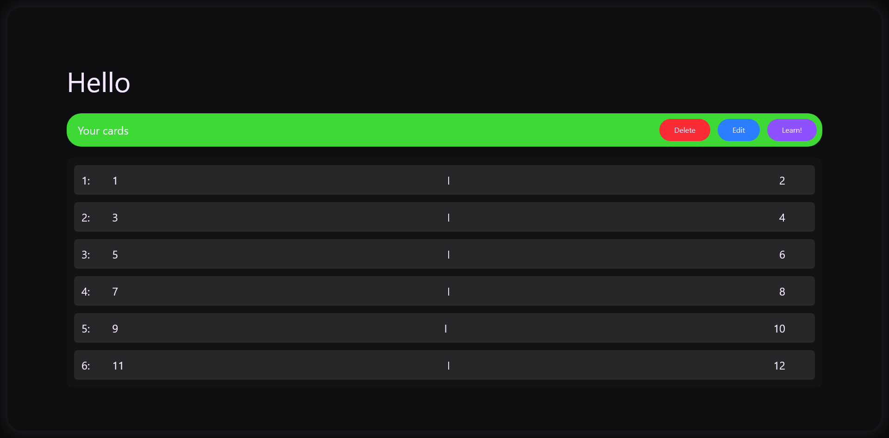
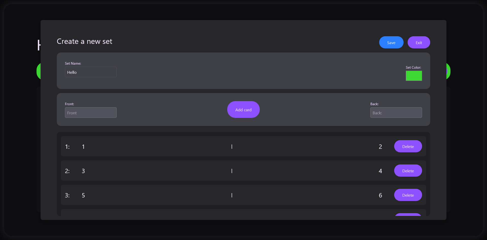
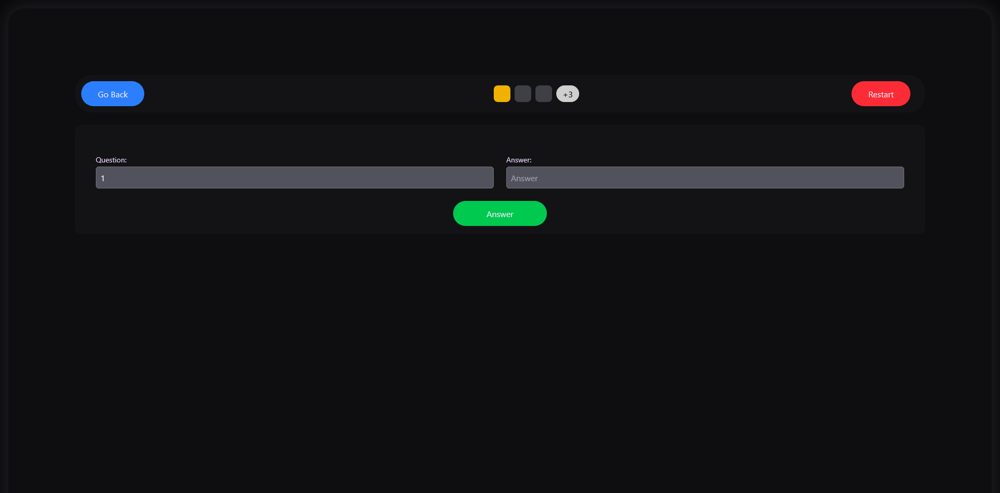
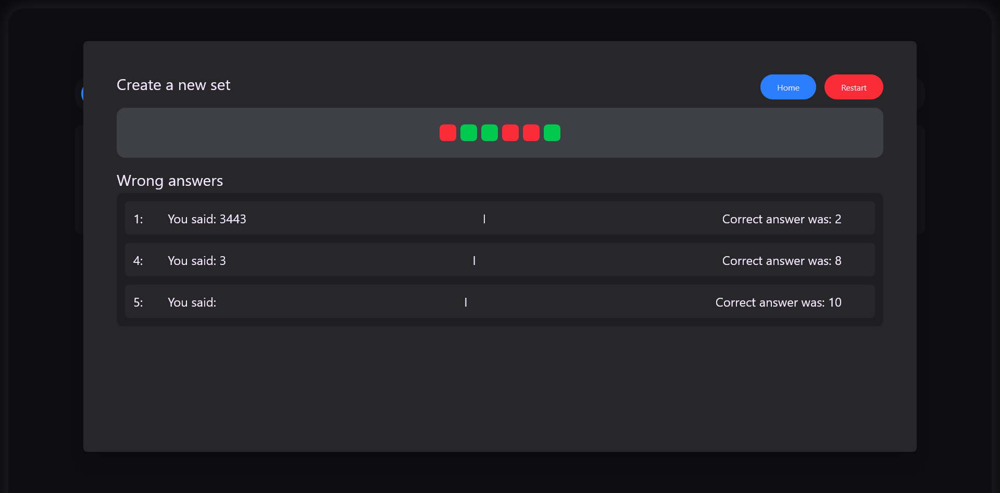

# Learn It
Learn It is an extremely minimal quiz platform developed by Markus Nielsen as a final project for programming 1.

## Features
Learn it has the following urls:

* /
* /card/ -> /
* /card/{uuid}
* /card/{uuid}/train

The home page has a button to create new sets and also lists all sets under it.

The card page redirects to the home page.

The card/{uuid} pages shows information on the sets. The information fetured is a list of the card and buttons to delete, edit and learn.

The card/{uuid}/learn page is where the actual quiz is. It has a input filed where you can type the answer and a button to answer. Then you have a restart and go back button. When you have answerd everything a model with what you did wrong and some statuson how it went.

## Run locally.
To run locally, make sure you have Node and NPM installed before continuing. To run, use the following command.
```shell
git clone https://github.com/VpgMackan/learn-it # or download from github
cd learn-it
npm install
npm run dev # to run in dev mode
npm run build && npm run start # for production use / testing
```

## Tech stack.
* NPM
* Next.js
* Local storage
* Tailwindcss







